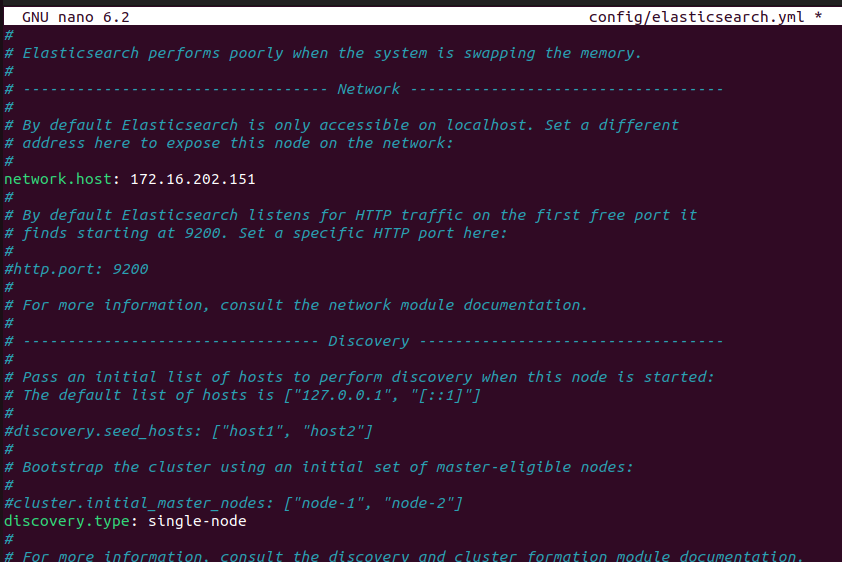
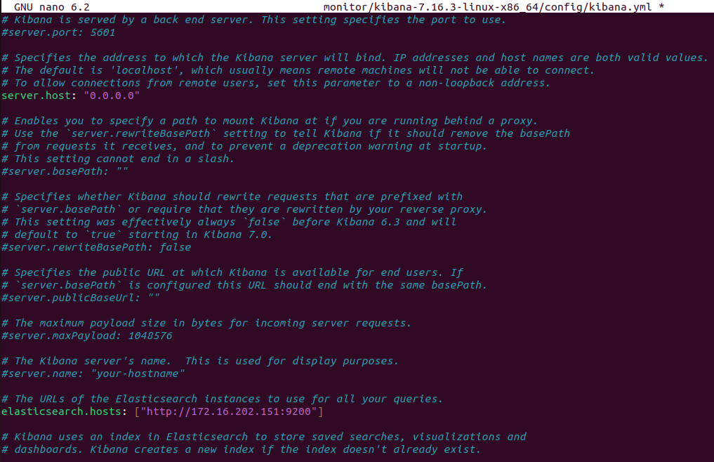

# SPEED RUN PROJET

[Retour Accueil](../../)

---

But : créer le projet rapidement de A à Z depuis un Ubuntu vierge.

> `COPIER` => `COLLER`

---

Mise à jour et installation des essentiels :

- Git
- Tree
- HTop
- Net-Tools
- JDK 11
- Apache
- Siege
- ... autres

```
sudo apt update && apt upgrade
sudo apt install git tree htop net-tools openjdk-11-jre-headless apache2 siege build-essential libnet-ssleay-perl liburi-perl libwww-perl
```

Création des dossiers nécessaires :

```
mkdir JPetStore_Infra
mkdir JPetStore_Infra/apps
mkdir JPetStore_Infra/apps/sproxy
mkdir JPetStore_Infra/agents
mkdir JPetStore_Infra/logs
mkdir JPetStore_Infra/monitors
mkdir JPetStore_Infra/proxy
```

Création des fichiers de logs :

```
touch JPetStore_Infra/logs/jpetstore_1.logs
touch JPetStore_Infra/logs/jpetstore_2.logs
touch JPetStore_Infra/logs/elasticsearch.logs
touch JPetStore_Infra/logs/kibana.logs
touch JPetStore_Infra/logs/apm_server.logs
```

Téléchargement des applications nécessaires :

- App Java - JPetStore
- Monitor - Elasticsearch
- Monitor - Kibana
- Monitor - APM Server
- App Java - APM Agent

```
cd JPetStore_Infra/apps
git clone https://github.com/kazuki43zoo/mybatis-spring-boot-jpetstore.git
wget https://artifacts.elastic.co/downloads/elasticsearch/elasticsearch-7.16.3-linux-x86_64.tar.gz
wget https://artifacts.elastic.co/downloads/kibana/kibana-7.16.3-linux-x86_64.tar.gz
wget https://artifacts.elastic.co/downloads/apm-server/apm-server-7.16.3-linux-x86_64.tar.gz
wget https://search.maven.org/remotecontent?filepath=co/elastic/apm/elastic-apm-agent/1.29.0/elastic-apm-agent-1.29.0.jar
mv 'remotecontent?filepath=co%2Felastic%2Fapm%2Felastic-apm-agent%2F1.29.0%2Felastic-apm-agent-1.29.0.jar' elastic-apm-agent-1.29.0.jar
wget https://download.joedog.org/sproxy/sproxy-latest.tar.gz
```

Décompression des applications nécessaires :

```
tar -xzvf elasticsearch-7.16.3-linux-x86_64.tar.gz
tar -xzvf kibana-7.16.3-linux-x86_64.tar.gz
tar -xzvf apm-server-7.16.3-linux-x86_64.tar.gz
tar -zxf sproxy-latest.tar.gz
```

Nettoyage des téléchargements :

```
sudo rm -r apm-server-7.16.3-linux-x86_64.tar.gz
sudo rm -r kibana-7.16.3-linux-x86_64.tar.gz
sudo rm -r elasticsearch-7.16.3-linux-x86_64.tar.gz
sudo rm -r sproxy-latest.tar.gz
sudo rm -r Dl/mybatis-spring-boot-jpetstore
```

Duplication de l'application JPetStore :

```
cd
cp -r Dl/mybatis-spring-boot-jpetstore/ JPetStore_Infra/apps/jpetstore_1
cp -r Dl/mybatis-spring-boot-jpetstore/ JPetStore_Infra/apps/jpetstore_2
```

On a donc les dossiers :

```
ls JPetStore_Infra/apps
ls JPetStore_Infra/agents
ls JPetStore_Infra/logs
ls JPetStore_Infra/monitors
ls JPetStore_Infra/proxy
```

Ils contiennent :

```
apps      ==>    jpetstore_1  jpetstore_2
agents    ==>    elastic-apm-agent-1.29.0.jar
logs      ==>    jpetstore_1.logs  jpetstore_2.logs
monitors  ==>    apm-server-7.16.3-linux-x86_64  elasticsearch-7.16.3  kibana-7.16.3-linux-x86_64
proxy     ==>    sproxy-1.02
```

Déplacement des applications dans les dossiers respectifs :

```
mv Dl/apm-server-7.16.3-linux-x86_64/ JPetStore_Infra/monitors/apm-server-7.16.3-linux-x86_64/
mv Dl/elasticsearch-7.16.3/ JPetStore_Infra/monitors/elasticsearch-7.16.3/
mv Dl/kibana-7.16.3-linux-x86_64/ JPetStore_Infra/monitors/kibana-7.16.3-linux-x86_64/
mv Dl/elastic-apm-agent-1.29.0.jar JPetStore_Infra/agents/elastic-apm-agent-1.29.0.jar
mv Dl/sproxy-1.02/ JPetStore_Infra/proxy/sproxy-1.02/
```

Configuration des applications JPetStore :

```
nano JPetStore_Infra/apps/jpetstore_1/src/main/resources/application.properties
nano JPetStore_Infra/apps/jpetstore_2/src/main/resources/application.properties
```

Il faut ajouté un port à l'application **JPetStore N°1** et **JPetStore N°2** ainsi que désactiver la configuration **datasource**.
Pour cela, il faut faire :

- **Port** :
  - Dans la confiiguration **JPetStore N°1** : ajouté `server.port=8081`
  - Dans la confiiguration **JPetStore N°2** : ajouté `server.port=8082`
- **Datasource** : 
  - Dans la confiiguration **JPetStore N°1** : ajouté `;hsqldb.lock_file=false` à la configuration `spring.datasource` afin d'obtenir :
▶ `spring.datasource.url=jdbc:hsqldb:file:~/db/jpetstore;hsqldb.lock_file=false`

> Résultat de la configuration de **JPetStore N°1** :
> 
> 
> 
> Faites pareil avec **JPetStore N°2**

Configuration de JDK 11:

```
export JAVA_HOME=/usr/lib/jvm/java-11-openjdk-amd64
```

> Vérifier la bonne configuration :
>
> ```
> echo $JAVA_HOME
> ```
>
> *Résultat*
>
> ```
> /usr/lib/jvm/java-11-openjdk-amd64
> ```

Complication des applications **JPetStore N°1** et **JPetStore N°2**  :

JPetStore 1 :

```
cd
cd JPetStore_Infra/apps/jpetstore_1/
./mvnw clean package -DskipTests=true
```

JPetStore 2 :

```
cd
cd JPetStore_Infra/apps/jpetstore_2/
./mvnw clean package -DskipTests=true
```

> Attendre la fin de compilation de chaque :
> 
> ```
> [INFO] Replacing main artifact with repackaged archive
> [INFO] ------------------------------------------------------------------------
> [INFO] BUILD SUCCESS
> [INFO] ------------------------------------------------------------------------
> [INFO] Total time:  11:54 min
> [INFO] Finished at: 2022-10-07T23:22:51+02:00
> [INFO] ------------------------------------------------------------------------
> ```

Vérification des compilation des applications **JPetStore N°1** et **JPetStore N°2** 

JPetStore 1 et 2 :

```
cd
ls JPetStore_Infra/apps/jpetstore_1/target/
cd
ls JPetStore_Infra/apps/jpetstore_2/target/
```

Résultat de chaque dossier : 

```
classes                 maven-status
generated-sources       mybatis-spring-boot-jpetstore-2.0.0-SNAPSHOT.jar
generated-test-sources  mybatis-spring-boot-jpetstore-2.0.0-SNAPSHOT.jar.original
maven-archiver          test-classes
```

> Si ce **jar** `mybatis-spring-boot-jpetstore-2.0.0-SNAPSHOT.jar` existe, la compilation s'est bien passée.

---

Activation de Apache :

```
sudo systemctl enable apache2
sudo systemctl start apache2.service
sudo systemctl status apache2.service
```

Résultat :

```
ynchronizing state of apache2.service with SysV service script with /lib/systemd/systemd-sysv-install.
Executing: /lib/systemd/systemd-sysv-install enable apache2
● apache2.service - The Apache HTTP Server
     Loaded: loaded (/lib/systemd/system/apache2.service; enabled; vendor preset: enabled)
     Active: active (running) since Sat 2022-10-08 09:11:34 CEST; 5min ago
       Docs: https://httpd.apache.org/docs/2.4/
   Main PID: 752 (apache2)
      Tasks: 55 (limit: 7022)
     Memory: 8.5M
        CPU: 390ms
     CGroup: /system.slice/apache2.service
             ├─752 /usr/sbin/apache2 -k start
             ├─753 /usr/sbin/apache2 -k start
             └─754 /usr/sbin/apache2 -k start
oct. 08 09:11:33 ldumay-VirtualBox systemd[1]: Starting The Apache HTTP Server...
oct. 08 09:11:34 ldumay-VirtualBox apachectl[722]: AH00558: apache2: Could not reliably determine the server'>
oct. 08 09:11:34 ldumay-VirtualBox systemd[1]: Started The Apache HTTP Server.
```

Activer les extension de proxy :

```
sudo a2enmod proxy proxy_http proxy_balancer headers lbmethod_byrequests
sudo systemctl restart apache2
```

On récupère l'ip de la machine :

```
ifconfig
```

On crée et édite un fichier de configuration de vhost pour les application jpetstore que l'on appellera jpetstore.conf.

```
sudo nano /etc/apache2/sites-available/jpetstore.conf
```

Ci-dessous, le contenu du ficher jpetstore.conf.

```
<VirtualHost *:80>
    Header add Set-Cookie "ROUTEID=.%{BALANCER_WORKER_ROUTE}e; path=/" env=BALANCER_ROUTE_CHANGED
    ProxyRequests Off
    ProxyPreserveHost On

    <Proxy "balancer://mycluster">
        BalancerMember "http://192.168.1.252:8081" route=1
                #attention: il faut changer les IPs et vérifier les ports
        BalancerMember "http://192.168.1.252:8082" route=2
        ProxySet stickysession=ROUTEID
    </Proxy>

    ProxyPass "/" "balancer://mycluster/"
    ProxyPassReverse "/" "balancer://mycluster/"

    ErrorLog ${APACHE_LOG_DIR}/error.log
	CustomLog ${APACHE_LOG_DIR}/access.log combined
</VirtualHost>
```

Vérifier la bonne écriture et le contenu du fichier avec :

```
cat /etc/apache2/sites-available/jpetstore.conf
```

Désactiver le site par défaut d'apache.

```
sudo nano /etc/apache2/apache2.conf
```

> Avant :
> 
> 

> Après
> 
> 

Désactiver la configuration par défaut de apache :

```
sudo a2dissite
Your choices are: 000-default
Which site(s) do you want to disable (wildcards ok)?
000-default
Site 000-default disabled.
To activate the new configuration, you need to run:
  systemctl reload apache2
```
> ▶ `000-default`

Activer la configuration `jpetstore.conf`. 

```
sudo a2ensite
Your choices are: 000-default default-ssl jpetstore
Which site(s) do you want to enable (wildcards ok)?
jpetstore
Enabling site jpetstore.
To activate the new configuration, you need to run:
  systemctl reload apache2
```

> ▶ `jpetstore`

Redémarrer apache.

```
systemctl reload apache2
```

### 4.3 - Configuration de Elasticsearch - [Haut de page](#top) <a name="4-3"></a>

```
sudo nano JPetStore_Infra/monitors/elasticsearch-7.16.3/config/elasticsearch.yml
```

Résultat



> Configurer avec :
> - `network.host: 192.168.1.252`
> - `discovery.type: single-node`

### 4.4 - Configuration de Kibana - [Haut de page](#top) <a name="4-4"></a>

```
sudo nano JPetStore_Infra/monitors/kibana-7.16.3-linux-x86_64/config/kibana.yml
```

Résultat



> Configurer avec :
> - `server.host: 0.0.0.0`
> - `elasticsearch.hosts: http://192.168.1.252:9200/`

### 4.5 - Configuration de APM Serveur - [Haut de page](#top) <a name="4-5"></a>

```
sudo nano JPetStore_Infra/monitors/apm-server-7.16.3-linux-x86_64/apm-server.yml
```

Résultat


> Configurer avec :
> - `host: 0.0.0.0:8200`
> - `hosts: 192.168.1.252:9200`

### 4.6 - Configuration de **systctl.conf** - [Haut de page](#top) <a name="4-6"></a>

Ajouter le au fichier `sysctl.conf` :

```
sudo nano /etc/sysctl.conf
```

Configurer avec :
- `vm.max_map_count=262144`


Valider le :

```
sudo sysctl -w vm.max_map_count=262144
```

### 4.7 - Rechargher la configuration - [Haut de page](#top) <a name="4-7"></a>

```
sudo sysctl -p
```

Test des applications :

**JPetStore N°1**

```
java -jar JPetStore_Infra/apps/jpetstore_1/target/mybatis-spring-boot-jpetstore-2.0.0-SNAPSHOT.jar
```

**JPetStore N°2**

```
java -jar JPetStore_Infra/apps/jpetstore_2/target/mybatis-spring-boot-jpetstore-2.0.0-SNAPSHOT.jar
```

**Elasticsearch**

```
./JPetStore_Infra/monitors/elasticsearch-7.16.3/bin/elasticsearch
```

> - Peut être un peut long à démarrer.

**Kibana**

```
./JPetStore_Infra/monitors/kibana-7.16.3-linux-x86_64/bin/kibana
```

> - Dépends de Elastic search
> - Peut être un peut long à démarrer.

**APM Serveur**

```
cd JPetStore_Infra/monitors/apm-server-7.16.3-linux-x86_64/
./apm-server -e
```

> A vérifier si celui-ci fonctionne belle et bien correctement.

Démarrage des services :

Lancer **JPetStore N°1** et **JPetStore N°2** :

```
nohup java -javaagent:/home/ldumay/JPetStore_Infra/agents/elastic-apm-agent-1.29.0.jar -Delastic.apm.service_name=JpetStore_1 -Delastic.apm.server_url='http://192.168.1.252:8200' -jar JPetStore_Infra/apps/jpetstore_1/target/mybatis-spring-boot-jpetstore-2.0.0-SNAPSHOT.jar > JPetStore_Infra/logs/jpetstore_1.logs &
nohup java -javaagent:/home/ldumay/JPetStore_Infra/agents/elastic-apm-agent-1.29.0.jar -Delastic.apm.service_name=JpetStore_2 -Delastic.apm.server_url='http://192.168.1.252:8200' -jar JPetStore_Infra/apps/jpetstore_1/target/mybatis-spring-boot-jpetstore-2.0.0-SNAPSHOT.jar > JPetStore_Infra/logs/jpetstore_1.logs &
```

Lancer **Elasticsearch**, **Kibana** puis **APM Serveur**:
```
./JPetStore_Infra/monitors/elasticsearch-7.16.3/bin/elasticsearch > JPetStore_Infra/logs/elasticsearch.logs &
./JPetStore_Infra/monitors/kibana-7.16.3-linux-x86_64/bin/kibana > JPetStore_Infra/logs/kibana.logs &
./JPetStore_Infra/monitors/apm-server-7.16.3-linux-x86_64/apm-server -e > JPetStore_Infra/logs/apm_server.logs &
```

Résultat :

```
[1] 2746
[2] 2747
[3] 2835
[4] 3074
[5] 3075
```

Accès au applications

- JPetStore *(par LoadBalancer)* : [http://192.168.1.252/](http://192.168.1.252/)
  - JPetStore *(par port direct 8081)* : [http://192.168.1.252:8081/](http://192.168.1.252:8081/)
  - JPetStore *(par port direct 8082)* : [http://192.168.1.252:8082/](http://192.168.1.252:8082/)
- Elasticsearch : [http://192.168.1.252:9200/](http://192.168.1.252:9200/)
- APM Serveur : [http://192.168.1.252:8200/](http://192.168.1.252:8200/)
- Kibana : [http://192.168.1.252:5601/](http://192.168.1.252:5601/)

#### Résultat de Elasticsearch

```
{
  "name" : "ldumay-vm",
  "cluster_name" : "elasticsearch",
  "cluster_uuid" : "glBwYJqCTJC-aTZxfP8GJw",
  "version" : {
    "number" : "7.16.3",
    "build_flavor" : "default",
    "build_type" : "tar",
    "build_hash" : "4e6e4eab2297e949ec994e688dad46290d018022",
    "build_date" : "2022-01-06T23:43:02.825887787Z",
    "build_snapshot" : false,
    "lucene_version" : "8.10.1",
    "minimum_wire_compatibility_version" : "6.8.0",
    "minimum_index_compatibility_version" : "6.0.0-beta1"
  },
  "tagline" : "You Know, for Search"
}
```

#### Résultat de APM Serveur

```
{
  "build_date": "2022-01-06T23:27:35Z",
  "build_sha": "fde0af4fa2b9f39e518b333c5be56cf8be215ca0",
  "publish_ready": true,
  "version": "7.16.3"
}
```